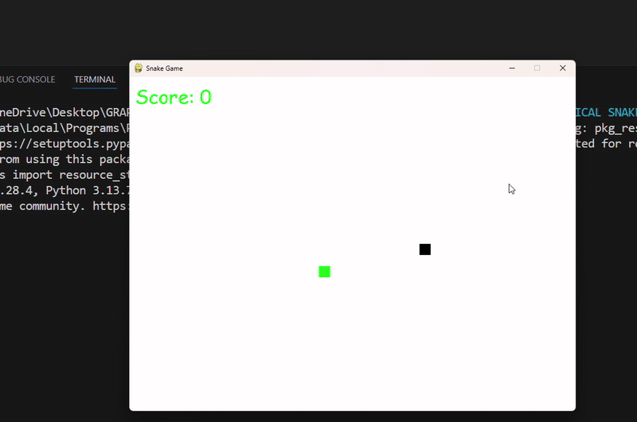

<div align="center">

# 🐍 Snake Game — Python & Pygame

**A smooth, collision-aware Snake game built with Python and Pygame — clean logic, real-time rendering, portfolio-ready.**

[](https://www.python.org/)
[](https://www.pygame.org/)
[](https://github.com/loisekk)
[](LICENSE)
[](https://github.com/loisekk)

> *"A modern twist on the classic Snake game — simple, fast, and addictive."* 🐍

</div>

---

## 🎥 Demo

<div align="center">
  
  <br/>
  <sub>Live gameplay — movement, food generation, scoring, and collision detection</sub>
</div>

---

## 📌 Overview

**Snake Game** is a Python implementation of the classic arcade game, built entirely with the `pygame` library.

The project demonstrates core game development fundamentals — game loops, real-time rendering, event handling, and collision logic — packaged in clean, modular Python code. No game engine abstractions. Pure logic, pure control.

---

## ✨ Features

| Feature | Details |
|---|---|
| 🎯 Smooth Controls | Arrow key input with frame-locked movement |
| 🍎 Food Generation | Random spawn using Python `random` module |
| 💥 Collision Detection | Wall boundary + self-collision game over |
| 📈 Score Tracking | Real-time score display, increments on eat |
| ⏱ Adjustable Speed | Clock-controlled FPS for difficulty tuning |
| 🔄 Restart | Instant game reset on game over |

---

## 🧠 How It Works

```
Init Pygame → Draw grid → Spawn food → Game loop starts
                                              ↓
                          Read input → Move snake → Check collision
                                              ↓
                              Hit food → Grow + Score++  → Continue
                              Hit wall/self → Game Over
```

**Core systems:**

| System | Implementation |
|---|---|
| Game Loop | `pygame` clock + fixed FPS tick |
| Snake Body | List of coordinate tuples, prepend head, pop tail |
| Food Spawn | `random.randint` within grid bounds, excludes snake body |
| Collision | Head == wall boundary or head in body list |

---

## 🛠 Tech Stack

| Layer | Tool | Purpose |
|---|---|---|
| Language | Python 3.11 | Core game logic |
| Game Engine | `pygame` | Rendering, input, clock |
| Randomization | `random` | Food position generation |

---

## 🚀 Getting Started

**Clone the repo:**

```bash
git clone https://github.com/loisekk/Snake-Game-Python.git
cd Snake-Game-Python
```

**Install dependency:**

```bash
pip install pygame
```

**Run the game:**

```bash
python snake_game.py
```

> Controls: `↑ ↓ ← →` to move. Avoid walls and yourself.

---

## 📂 Project Structure

```
Snake-Game-Python/
├── snake_game.py        # Main game loop, rendering, input handling
├── assets/
│   └── snake_game_demo.gif   # Gameplay demo
└── README.md
```

---

## 🎯 Learning Outcomes

- Understanding game loops and frame-rate control
- Handling real-time keyboard events with `pygame`
- Implementing collision detection without a physics engine
- Managing dynamic game state (snake body as a list)
- Writing clean, modular Python for game logic

---


## 👨‍💻 Author

**Yash Brahmankar**
B.Tech AI & ML | OIST, 2024–2028

[](https://github.com/loisekk)
[](mailto:yashbrahmankar95@gmail.com)

---

## 📄 License

Licensed under the [MIT License](LICENSE) — free to use, modify, and distribute.

---

<div align="center">
  <sub>Built with Python · Powered by Pygame · Classic reimagined</sub>
</div>
